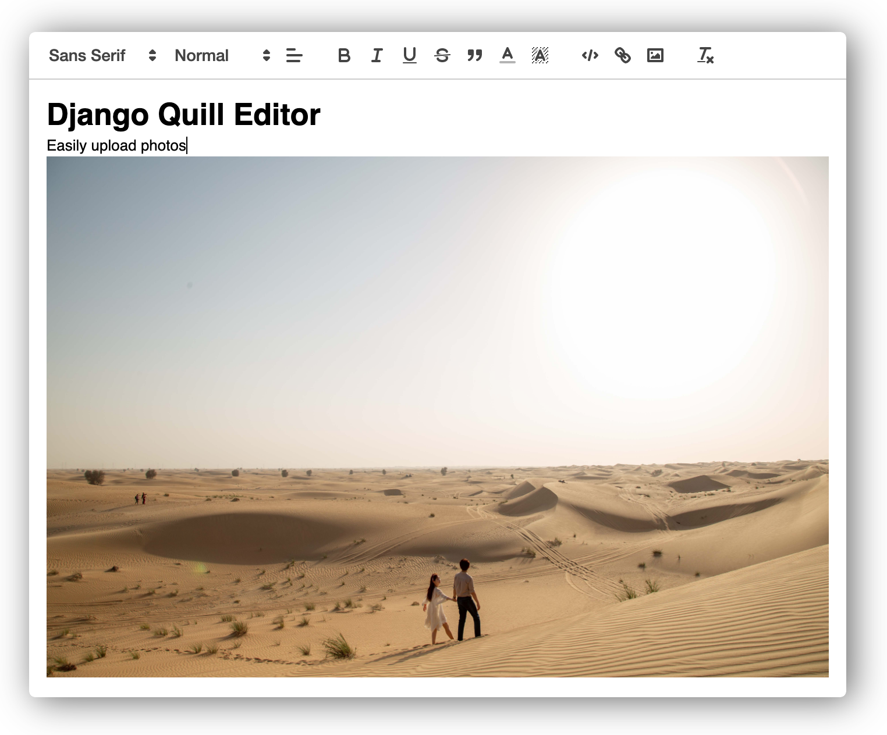
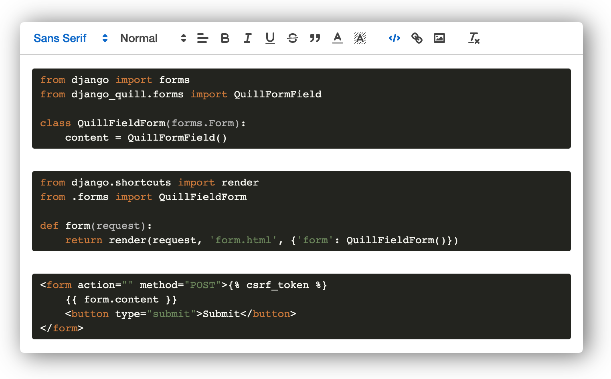

# django-quill-editor

**django-quill-editor** makes [Quill.js](https://quilljs.com/) easy to use on Django Forms and admin sites

- **No configuration required for static files!**
- The entire code for inserting WYSIWYG editor is less than 30 lines
- It can be used in both admin and Django views



## Setup

- Install `django-quill-editor` to your Python environment

  ```shell
  pip install django-quill-editor
  ```

- Add `django_quill` to `INSTALLED_APPS` in `settings.py`

  ```python
  # settings.py
  INSTALLED_APPS = [
      'django.contrib.admin',
      ...
      'django_quill',
  ]
  ```


## Run Sample project

- [Source code can be found here](https://github.com/LeeHanYeong/django-quill-editor/tree/master/sample)

```shell
# Clone repo, move to sample project
git clone https://github.com/LeeHanYeong/django-quill-editor
cd django-quill-editor/sample

# Create virtualenv (I used pyenv, but you can use other methods)
pyenv virtualenv 3.7.5 django-quill
pyenv local django-quill

# Install Python packages
pip install -r requirements.txt
python manage.py runserver
```


## Usage

Add `QuillField` to the **Model class** you want to use

```python
# models.py
from django.db import models
from django_quill.fields import QuillField

class QuillPost(models.Model):
    content = QuillField()
```


### 1. Django admin

Just register the Model in **admin.py** of the app.

```python
from django.contrib import admin
from .models import QuillPost

@admin.register(QuillPost)
class QuillPostAdmin(admin.ModelAdmin):
    pass
```


### 2. Form

- Add `QuillFormField` to the **Form class** you want to use

- There are two ways to add CSS and JS files to a template.

  - If there is a **Form** with QuillField added, add `{{ form.media }}` to the `<head>` tag.  

    ```django
    <head>
        {{ form.media }}
    </head>
    ```

  - Or, directly import the necessary CSS and JS files **(highlight.pack.js must be imported first!)**  

    ```django
    <head>
        <!-- highlight.js -->
        <link href="" rel="stylesheet">
        <script src=""></script>
    
        <!-- django-quill-editor -->
        <link href="" rel="stylesheet">
        <script src=""></script>
        <script src=""></script>
    </head>
    ```

    

```python
# forms.py
from django import forms
from django_quill.forms import QuillFormField

class QuillFieldForm(forms.Form):
    content = QuillFormField()
```

```python
# views.py
from django.shortcuts import render
from .forms import QuillFieldForm

def form(request):
    return render(request, 'form.html', {'form': QuillFieldForm()})
```

```django
<!-- Template -->
<form action="" method="POST">
    {{ form.content }}
</form>
```


### 3. ModelForm

Just define and use **ModelForm** of Model class

```python
# forms.py
from django import forms
from .models import QuillPost

class QuillPostForm(forms.ModelForm):
    class Meta:
        model = QuillPost
        fields = (
            'content',
        )
```

```python
# views.py
from django.shortcuts import render
from .forms import QuillPostForm

def model_form(request):
    return render(request, 'model_form.html', {'form': QuillPostForm()})
```

```django
<!-- Template -->
<form action="" method="POST">
    {{ form.content }}
</form>
```

**Form, ModelForm's Output:**




## Contributing

As an open source project, we welcome contributions.
The code lives on [GitHub](https://github.com/LeeHanYeong/django-quill-editor)

